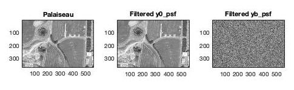
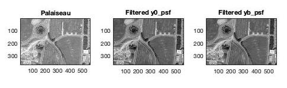

# Basic filters for image restitution

When acquiring an image, several disturbances can be introduced by the imaging system, the acquisition chain or the surrounding noise. 

The file `main.m` explores and develops basic filtering methods that allow us to reconstruct an image as faithfully as possible:
- inverse filter
- Wiener filter

Windows are in `data/windows.mat`.

Images that we will work with are in `data`:

## Part 1

First we observe the windows that will be applied on the Palaiseau image in order to simulate disturbances.

Point spread function (PSF):

PSF Fourier:

Rectangle (Rect):

Rect Fourier:

Fourier tranform cuts at zero frequency:

Let's take a look at the effect these disturbances have on the images. `y0` represents the disturbed image without additional noise, `yb` represents the disturbed image with additive white gaussian noise.

The first filter we will study is the most basic one, the inverse filter. Naturally this filter does not work when there is additional noise, as it amplifies it:

The second filter is the Wiener filter, which works well even in the presence of additional noise:

## Part 2

Application of the Wiener filter for camera shake.

